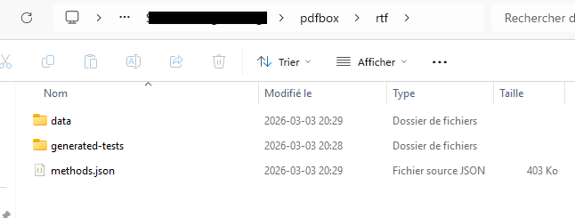

<div align="center">
  <h1>ProDJ</h1>
</div>

`ProDJ` is a tool for serializing Java objects to plain code.
It uses these capabilities to automatically generate test-cases from a
production workload.

See [Serializing Java Objects in Plain Code](http://arxiv.org/pdf/2405.11294) (Julian Wachter, Deepika Tiwari, Martin Monperrus and Benoit Baudry), Journal of Software and Systems, 2025.

```bibtex
@article{2405.11294,
 title = {Serializing Java Objects in Plain Code},
 journal = {Journal of Systems and Software},
 year = {2025},
 doi = {10.1016/j.jss.2025.112721},
 author = {Julian Wachter and Deepika Tiwari and Martin Monperrus and Benoit Baudry},
 url = {http://arxiv.org/pdf/2405.11294},
}
```

## Setup
The easiest way to get an executable version of `ProDJ` is to use the provided
`flake.nix`:
1. Enter a dev-shell using `nix develop`
2. Run `java -jar rockstofetch/target/rockstofetch.jar --statistics <config file>`.
   You can find example config files in `rockstofetch/src/test/resources/`.

_____________________________________________

Updates on 20260303

Environment:

Maven : Apache Maven 3.9.12 

Java : openjdk version "17.0.18"

Windows X64

##How to run this project?

Step 1:

Compile and package : mvn -DskipTests package

Step 2:

Put the prodj\rockstofetch\src\test\resources\CodeMonkey.pdf to the root path of the Pdfbox

Step 3:

git clone https://github.com/apache/pdfbox.git -b trunk

Compile and package Pdfbox.

Step 4:

For windows: java -jar rockstofetch/target/rockstofetch.jar --statistics rockstofetch/src/test/resources/pdfbox_windows.json

For Mac: ...

For Linux: ...

## What will happen?

Data and new tests will be generated in the Pdfbox. 

## How the run the generated tests?

Set-Location 'C:\your_path\pdfbox'; mvn -Dtest=*RockyTest -Dsurefire.failIfNoSpecifiedTests=false test



## About the LLM

I'm working on integrating CodeT5-base to this pipeline. CodeT5-base is a Transformer-based pre-trained model for programming languages, proposed by researchers at Salesforce.It is built on the architecture of T5 and is designed specifically for code understanding and code generation tasks involving both natural language (NL) and source code.

Reference：[Wang, Yue, et al. "Codet5: Identifier-aware unified pre-trained encoder-decoder models for code understanding and generation." ](2021.https://aclanthology.org/2021.emnlp-main.685.pdf)

Github: [CodeT5](https://github.com/salesforce/CodeT5)

Hugging Face: [CodeT5-base](https://huggingface.co/Salesforce/codet5-base)

So CodeT5-base contains approximately 220 million parameters.Typical architecture configuration:

- Encoder–Decoder Transformer

- 12 encoder layers

- 12 decoder layers
  
- Hidden size ≈ 768
  
- Attention heads ≈ 12

This configuration is very similar to T5-base.

## test the LLM

Environment: python (see the rockstofetch/test/resourses/LLM/requirements.txt) + CodeT5.

Get LLM: run test_codet5.py (see the rockstofetch/test/resourses/LLM/test_code5.py).

Run LLM Service: run t5_service.py (see the rockstofetch/test/resourses/LLM/t5_service.py).


